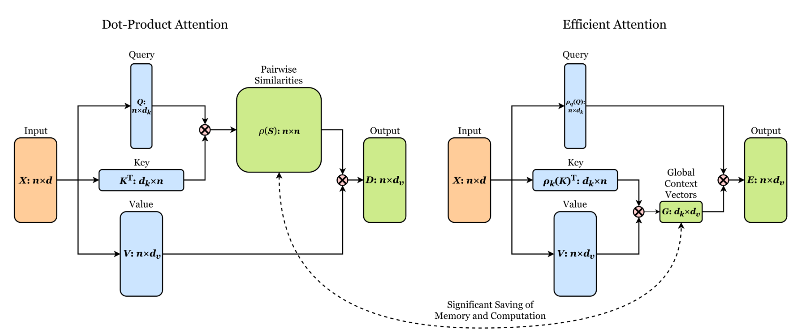

## Linear Attention Transformer



[](https://badge.fury.io/py/linear-attention-transformer)

A fully featured Transformer that mixes (QKᵀ)V local attention with Q(KᵀV) global attention (scales linearly with respect to sequence length) for efficient long-range language modeling.

## Install

```bash
$ pip install linear-attention-transformer
```

## Usage

Language model

```python
import torch
from linear_attention_transformer import LinearAttentionTransformerLM

model = LinearAttentionTransformerLM(
    num_tokens = 20000,
    dim = 512,
    heads = 8,
    depth = 1,
    max_seq_len = 8192,
    causal = True,                  # auto-regressive or not
    ff_dropout = 0.1,               # dropout for feedforward
    attn_layer_dropout = 0.1,       # dropout right after self-attention layer
    attn_dropout = 0.1,             # dropout post-attention
    emb_dim = 128,                  # embedding factorization, to save on memory
    dim_head = 128,                 # be able to fix the dimension of each head, making it independent of the embedding dimension and the number of heads
    blindspot_size = 64,            # this gives the q(kv) attention a blindspot of 64 tokens back in the causal case, but gives back an order of magnitude return in memory savings. should be paired with local attention of at least a window size of this setting. setting this to 1 will allow for full q(kv) attention of past
    n_local_attn_heads = 4,         # number of local attention heads for (qk)v attention. this can be a tuple specifying the exact number of local attention heads at that depth
    local_attn_window_size = 128,   # receptive field of the local attention
    reversible = True,              # use reversible nets, from Reformer paper
    ff_chunks = 2,                  # feedforward chunking, from Reformer paper
    ff_glu = True,                  # use GLU variant for feedforward
    attend_axially = False,         # will fold the sequence by the local attention window size, and do an extra strided attention followed by a feedforward with the cheap q(kv) attention
    shift_tokens = True             # add single token shifting, for great improved convergence
).cuda()

x = torch.randint(0, 20000, (1, 8192)).cuda()
model(x) # (1, 8192, 512)
```

Transformer

```python
import torch
from linear_attention_transformer import LinearAttentionTransformer

model = LinearAttentionTransformer(
    dim = 512,
    heads = 8,
    depth = 1,
    max_seq_len = 8192,
    n_local_attn_heads = 4
).cuda()

x = torch.randn(1, 8192, 512).cuda()
model(x) # (1, 8192, 512)
```

Encoder / decoder

```python
import torch
from linear_attention_transformer import LinearAttentionTransformerLM

enc = LinearAttentionTransformerLM(
    num_tokens = 20000,
    dim = 512,
    heads = 8,
    depth = 6,
    max_seq_len = 4096,
    reversible = True,
    n_local_attn_heads = 4,
    return_embeddings = True
).cuda()

dec = LinearAttentionTransformerLM(
    num_tokens = 20000,
    dim = 512,
    heads = 8,
    depth = 6,
    causal = True,
    max_seq_len = 4096,
    reversible = True,
    receives_context = True,
    n_local_attn_heads = 4
).cuda()

src = torch.randint(0, 20000, (1, 4096)).cuda()
src_mask = torch.ones_like(src).bool().cuda()

tgt = torch.randint(0, 20000, (1, 4096)).cuda()
tgt_mask = torch.ones_like(tgt).bool().cuda()

context = enc(src, input_mask = src_mask)
logits = dec(tgt, context = context, input_mask = tgt_mask, context_mask = src_mask)
```

## Linformer

Linformer is another variant of attention with linear complexity championed by Facebook AI. It only works with non-autoregressive models of a fixed sequence length. If your problem satisfies that criteria, you may choose to try it out.

```python
from linear_attention_transformer import LinearAttentionTransformerLM, LinformerSettings

settings = LinformerSettings(k = 256)

enc = LinearAttentionTransformerLM(
    num_tokens = 20000,
    dim = 512,
    heads = 8,
    depth = 6,
    max_seq_len = 4096,
    linformer_settings = settings
).cuda()
```

You can also used Linformer for the contextual attention layer, if the contextual keys are of a fixed sequence length.

```python
from linear_attention_transformer import LinearAttentionTransformerLM, LinformerContextSettings

settings = LinformerContextSettings(
  seq_len = 2048,
  k = 256
)

dec = LinearAttentionTransformerLM(
    num_tokens = 20000,
    dim = 512,
    heads = 8,
    depth = 6,
    max_seq_len = 4096,
    causal = True,
    context_linformer_settings = settings,
    receives_context = True
).cuda()
```

## Images

This repository also contains a concise implementation of this efficient attention for images

```python
import torch
from linear_attention_transformer.images import ImageLinearAttention

attn =ImageLinearAttention(
  chan = 32,
  heads = 8,
  key_dim = 64       # can be decreased to 32 for more memory savings
)

img = torch.randn(1, 32, 256, 256)
attn(img) # (1, 32, 256, 256)
```

## Citations

```bibtex
@inproceedings{katharopoulos-et-al-2020,
  author    = {Katharopoulos, A. and Vyas, A. and Pappas, N. and Fleuret, F.},
  title     = {Transformers are RNNs: Fast Autoregressive Transformers with Linear Attention},
  booktitle = {Proceedings of the International Conference on Machine Learning (ICML)},
  year      = {2020},
  url       = {https://arxiv.org/abs/2006.16236}
}
```

```bibtex
@article{shen2019efficient,
  author    = {Zhuoran Shen and
               Mingyuan Zhang and
               Haiyu Zhao and
               Shuai Yi and
               Hongsheng Li},
  title     = {Efficient Attention: Attention with Linear Complexities},
  journal   = {CoRR},
  volume    = {abs/1812.01243},
  year      = {2018},
  url       = {http://arxiv.org/abs/1812.01243}
}
```

```bibtex
@inproceedings{kitaev2020reformer,
    title       = {Reformer: The Efficient Transformer},
    author      = {Nikita Kitaev and Lukasz Kaiser and Anselm Levskaya},
    booktitle   = {International Conference on Learning Representations},
    year        = {2020},
    url         = {https://openreview.net/forum?id=rkgNKkHtvB}
}
```

```bibtex
@misc{shazeer2020glu,
    title   = {GLU Variants Improve Transformer},
    author  = {Noam Shazeer},
    year    = {2020},
    url     = {https://arxiv.org/abs/2002.05202}
}
```

```bibtex
@misc{wang2020linformer,
    title   = {Linformer: Self-Attention with Linear Complexity},
    author  = {Sinong Wang and Belinda Z. Li and Madian Khabsa and Han Fang and Hao Ma},
    year    = {2020},
    eprint  = {2006.04768}
}
```

```bibtex
@misc{bhojanapalli2020lowrank,
    title   = {Low-Rank Bottleneck in Multi-head Attention Models},
    author  = {Srinadh Bhojanapalli and Chulhee Yun and Ankit Singh Rawat and Sashank J. Reddi and Sanjiv Kumar},
    year    = {2020},
    eprint  = {2002.07028}
}
```

```bibtex
@techreport{zhuiyiroformer,
    title   = {RoFormer: Transformer with Rotary Position Embeddings - ZhuiyiAI},
    author  = {Jianlin Su},
    year    = {2021},
    url     = "https://github.com/ZhuiyiTechnology/roformer",
}
```
